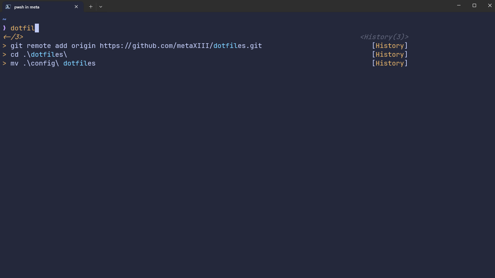

# Windows Terminal

## Install windows terminal (**latest version**)

Windows Terminal should be installed by default, if not:
- Go to Microsoft Store and search windows terminal

To check if it is installed : 
`windows` + `r`

inside the prompt enter : `wt`

This should run `windows terminal`


## (**Optional** : Install Scoop)
```pwsh
Set-ExecutionPolicy -ExecutionPolicy RemoteSigned -Scope CurrentUser
Invoke-RestMethod -Uri https://get.scoop.sh | Invoke-Expression
```

## Install powershell
```pwsh
scoop install pwsh
```

### Warning
Be sure you're using the latest version for powershell by default in windows terminal by default.


### Themes and extensions
```pwsh
Install-Module -Name Terminal-Icons
mkdir ~/.config/powershell
New-Item -Path $PROFILE -Type File -Force
winget install Microsoft.VCRedist.2015+.x64
scoop install neovim
nvim $PROFILE.CurrentUserCurrentHost
. $env:USERPROFILE\.config\powershell\user_profile.ps1
```

`.config/powershell/user_profile.ps1`:
```ps1
# set PowerShell to UTF-8
[console]::InputEncoding = [console]::OutputEncoding = New-Object System.Text.UTF8Encoding
$separator = "----------------------------------------------------------------------"
# Prompt
oh-my-posh init pwsh --config $HOME'/.config/powershell/zen.toml' | Invoke-Expression
# Module
Import-Module Terminal-Icons
# Alias
Set-Alias apt scoop
Set-Alias vim nvim
Set-Alias ll ls
Set-Alias grep findstr
Set-Alias tig 'C:\Program Files\Git\usr\bin\tig.exe'
Set-Alias less 'C:\Program Files\Git\usr\bin\less.exe'
Set-Alias g git
Set-Alias l ll
Set-Alias touch New-Item
Set-PSReadLineOption -BellStyle None
Set-PSReadLineKeyHandler -Chord 'Ctrl+d' -Function DeleteChar
Set-PSReadLineOption -PredictionSource History
Set-PSReadLineOption -PredictionViewStyle ListView

function aze($number) {
    if ($number) {
        git add .
        m("fix")
        git rebase -i HEAD~$number
        git push -f
    }
    else {
        git add . 
        m("fix")
        git rebase -i HEAD~2 
        git push -f
    }
}
function backup($argument) {
    $date = Get-date -Format 'yyyy_MM_dd'
    if ($argument -eq "wsl") {
        $directory = "C:\Users\MyUser\Documents\BackUp\"
        $fileName = $directory + "ubuntu_back_up-" + $date + ".tar"
        if (Test-Path -path $fileName) {
            Write-Output "file exist -- Abort back up WSL"
        }
        else {
            $count_backup = Get-ChildItem $directory -File | Measure-Object | ForEach-Object { $_.Count }
            if ($count_backup -gt 4 ) {
                Write-Output "WSL ------- There is more than 5 saves"
                $files = Get-ChildItem $directory -File | Sort-Object LastWriteTime
                $concerned_file = $files[0].Name
                # remove file to keep only 5 last back ups
                Remove-Item -Force -Recurse -Verbose $directory$concerned_file
                Write-Output "Back up was successfully removed"
                Write-Output $separator
                Write-Output ""
                wsl --export Ubuntu $fileName
            }
            else {
                wsl --export Ubuntu $fileName
            }
            Write-Output "WSL Export Successfully Finished"
            Write-Output $separator
        }
        # 
    }
    else {
        Write-Output "no argument specified"
    }
}
function bye() {
    shutdown -s -t 0
}
function checkout($branchName) {
    git checkout $branchName
}
function config() {
    code $env:USERPROFILE/.config
}
function create($subject, $content) {
    if ($subject -eq "branch") {
        pull
        git checkout -b $content
    }
}
function dev() {
    git checkout develop
}
function fix() {
    git pull --rebase origin master 
    git push -f
}
function gitconfig() {
    vim $HOME/.gitconfig
}
function gg() {
    git push -f
}
function gs() {
    git status
}
function la() {
    Get-ChildItem -Force
}
function m($message, $commitMessage) {
    if ($commitMessage) {
        git add .
        git commit -am $message -m $commitMessage 
        git push    
    }
    else {
        git add . 
        git commit -am $message 
        git push
    }
}
function master() {
    git checkout master
}
function open($path) {
    explorer $path
}
function pull() {
    git pull
}
function re() {
    git checkout HEAD -- ./*
}
function rebase($number) {
    if ($number) {
        git rebase -i HEAD~$number
        git push -f
    }
    else {
        git rebase -i HEAD~2
        git push -f
    }
}
function reboot() {
    shutdown /f /s /t 0
}
function rmf($path) {
    Remove-Item -Force -Recurse -Verbose $path
}
function status() {
    git status
}
function uninstall($app) {
    winget uninstall $app
    winget install $app
}
function update() {
    Write-Output "back up WSL"
    Write-Output $separator
    backup "wsl"
    Write-Output "back up WSL"
    Write-Output $separator
    Write-Output "upgrade via Winget"
    winget upgrade --all
    Write-Output "upgrade via scoop"
    Write-Output $separator
    apt update *
}
function which ($command) {
    Get-Command -Name $command -ErrorAction SilentlyContinue |
    Select-Object -ExpandProperty Path -ErrorAction SilentlyContinue
}

```

### Note
As you can noticed, some alias are already present inside, do not hesitate to adapt them or modify or delete them.

## Themes:

insert into `settings.json` > in section `schemes` : 
```json
{
            "background": "#24283B",
            "black": "#1D202F",
            "blue": "#7AA2F7",
            "brightBlack": "#414868",
            "brightBlue": "#7AA2F7",
            "brightCyan": "#7DCFFF",
            "brightGreen": "#9ECE6A",
            "brightPurple": "#BB9AF7",
            "brightRed": "#F7768E",
            "brightWhite": "#C0CAF5",
            "brightYellow": "#E0AF68",
            "cursorColor": "#C0CAF5",
            "cyan": "#7DCFFF",
            "foreground": "#C0CAF5",
            "green": "#9ECE6A",
            "name": "tokyonight-storm",
            "purple": "#BB9AF7",
            "red": "#F7768E",
            "selectionBackground": "#364A82",
            "white": "#A9B1D6",
            "yellow": "#E0AF68"
        }
```

## Themes (**zen.toml**)

````toml
console_title_template = '{{ .Shell }} in {{ .Folder }}'
version = 3
final_space = true

[secondary_prompt]
  template = '❯❯ '
  foreground = 'magenta'
  background = 'transparent'

[transient_prompt]
  template = '❯ '
  background = 'transparent'
  foreground_templates = ['{{if gt .Code 0}}red{{end}}', '{{if eq .Code 0}}magenta{{end}}']

[[blocks]]
  type = 'prompt'
  alignment = 'left'
  newline = true

  [[blocks.segments]]
    template = '{{ .Path }}'
    foreground = 'blue'
    background = 'transparent'
    type = 'path'
    style = 'plain'

    [blocks.segments.properties]
      style = 'full'

  [[blocks.segments]]
    template = ' {{ .HEAD }}{{ if or (.Working.Changed) (.Staging.Changed) }}*{{ end }} <cyan>{{ if gt .Behind 0 }}⇣{{ end }}{{ if gt .Ahead 0 }}⇡{{ end }}</>'
    foreground = 'p:grey'
    background = 'transparent'
    type = 'git'
    style = 'plain'

    [blocks.segments.properties]
      branch_icon = ''
      commit_icon = '@'
      fetch_status = true

[[blocks]]
  type = 'rprompt'
  overflow = 'hidden'

  [[blocks.segments]]
    template = '{{ .FormattedMs }}'
    foreground = 'yellow'
    background = 'transparent'
    type = 'executiontime'
    style = 'plain'

    [blocks.segments.properties]
      threshold = 5000

[[blocks]]
  type = 'prompt'
  alignment = 'left'
  newline = true

  [[blocks.segments]]
    template = '❯'
    background = 'transparent'
    type = 'text'
    style = 'plain'
    foreground_templates = ['{{if gt .Code 0}}red{{end}}', '{{if eq .Code 0}}magenta{{end}}']
````

themes and a command in action are shown here: 

> 
